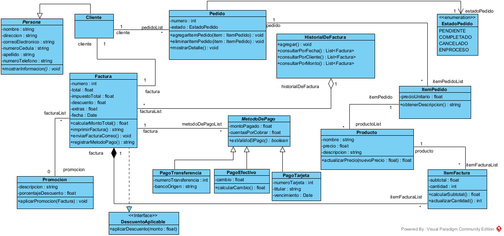

# FacturacionExa
## Integrantes
- Valverde Christian
- Encalada Juan Diego
- Jimbo Darwin
## Descripcion
El siguiente diagrama presenta el diseño de un sistema de facturacion y pagos desarrollado para el gestionamiento eficiente de un restaurante, permitiendo la creacion y gestionamiento del pago de productos de una manera facil de entender.

El sistema de facturación y pagos para un restaurante permite gestionar los pedidos de los clientes, generar facturas y procesar pagos de diversas maneras. Cada cliente puede realizar pedidos que se componen de varios productos. Los pedidos tienen un estado que indica su progreso desde la realización hasta la entrega.

Las facturas se generan con base en los pedidos y pueden aplicar promociones y descuentos si es necesario. Los métodos de pago permiten que los clientes paguen sus facturas mediante tarjeta, efectivo o transferencia bancaria. Cada método de pago tiene sus propias validaciones y procesos de pago.

El historial de facturas almacena todas las facturas emitidas, permitiendo búsquedas por fecha o cliente. Además, los items de las facturas y pedidos se gestionan para mantener un registro detallado de los productos vendidos y su disponibilidad.

Este sistema asegura una gestión eficiente de las transacciones y ayuda a mantener la calidad del servicio, mejorando la experiencia del cliente en el restaurante.

1. Aplicación de Abstracción y Encapsulación

Abstracción

Identificación de entidades clave: El sistema abstrae las entidades principales del dominio, como Cliente, Pedido, Producto, Factura y MetodoDePago.

Generalización de comportamientos: Se creó una clase base abstracta MetodoDePago, de la cual derivan subclases específicas como TarjetaDeCredito y TransferenciaBancaria. Esto permite manejar los diferentes tipos de pago de manera uniforme y escalable.

Encapsulación

Cada clase protege sus atributos utilizando modificadores de acceso (private y protected), garantizando que solo se puedan manipular a través de métodos públicos y controlados, como getters y setters.

Ejemplo: La clase Producto encapsula atributos como nombre, precio y cantidad, asegurando la validación de datos al momento de la modificación.

2. Decisiones de Diseño Relacionadas con Herencia y Polimorfismo

Uso de herencia:

Se diseñó una jerarquía para los diferentes MetodoDePago reutilizando código común.

Por ejemplo, las validaciones generales están en la clase base MetodoDePago, mientras que las validaciones específicas (como verificar fondos en TarjetaDeCredito) están en las subclases.

Uso de polimorfismo:

El método esValidoElPago() se define en la clase base y es sobrescrito en cada subclase. Esto permite que el sistema invoque este método sin preocuparse por el tipo específico del pago.

Ventaja: Extensibilidad al incluir nuevos tipos de pago sin modificar el código existente.

3. Desafíos Encontrados y Soluciones

Desafíos

Evitar redundancias en la relación entre Pedido y Producto:

Solución: Se implementó una relación de composición, donde un Pedido contiene una lista de Producto.

Garantizar la extensibilidad del sistema para nuevos métodos de pago:

Solución: Diseñar MetodoDePago como una clase abstracta, facilitando la adición de nuevos tipos de pago mediante subclases.

Manejo de asociaciones complejas:

Solución: Se agregó una asociación bidireccional entre Cliente y Pedido, mejorando la trazabilidad entre ambos.

4. Cambios Respecto al Diagrama UML Inicial

Modificaciones Realizadas

Incorporación de la clase Cliente:

Razón: Facilitar la gestión de información de los clientes.

Optimización de la clase Factura:

Asociaciones directas con Pedido y MetodoDePago, eliminando redundancias.

Rediseño de MetodoDePago:

Se definió como una clase abstracta para mejorar la extensibilidad.

Impacto Positivo

Las modificaciones mejoraron la escalabilidad y mantenibilidad del sistema.

Redujeron la redundancia en las asociaciones entre clases y facilitaron la inclusión de nuevos requisitos.

## Imagen del diagrama de la Facturacion Version 0.1

## Imagen del diagrama de la Facturacion Version 0.2  

El cambio realizado en el diagrama se debe a que la version anterior presentaba redundancias en la definicion de atributos. El objetivo de esta modificación es optimizar el diagrama de clases eliminando dichas redundancias para mejorar la eficiencia y la mantenibilidad del sistema.
## Licencia
Copyright (c) 2024 [Valverde Christian, Encalada Juan Diego, Jimbo Darwin.]

  Por el presente se otorga permiso, sin cargo, a cualquier persona que obtenga una copia de este diagrama y los archivos de documentación asociados, para utilizarlo a su favor sin restricciones, incluidos, entre otros, los derechos de uso, copia, modificación, fusión. , publicar y distribuir, y permitir que las personas a quienes se les proporciona esta informacion lo hagan, sujeto a las siguientes condiciones:

EL DIAGRAMA SE PROPORCIONA "TAL CUAL", SIN GARANTÍA DE NINGÚN TIPO, EXPRESA O IMPLÍCITA, INCLUYENDO PERO NO LIMITADO A LAS GARANTÍAS DE COMERCIABILIDAD, IDONEIDAD PARA UN PROPÓSITO PARTICULAR Y NO INFRACCIÓN. EN NINGÚN CASO LOS AUTORES O TITULARES DE DERECHOS DE AUTOR SERÁN RESPONSABLES DE NINGÚN RECLAMO, DAÑO U OTRA RESPONSABILIDAD, YA SEA EN UNA ACCIÓN CONTRACTUAL, AGRAVIO O DE OTRA MANERA, QUE SURJA DE, FUERA DE O EN RELACIÓN CON EL DIAGRAMA O EL USO U OTRAS NEGOCIOS RELACIONADOS.

